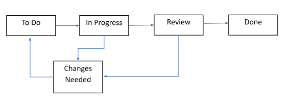

<a href="../index.md">Home</a> &gt;
 <a href="jira-feature-guide.md">Feature Guide</a> &gt;

# Feature Guide: Managing Tasks and Issues in Jira

## Copyright

## Table of Contents

- [Feature Guide: Managing Tasks and Issues in Jira](#feature-guide-managing-tasks-and-issues-in-jira)
  - [Copyright](#copyright)
  - [Table of Contents](#table-of-contents)
  - [Introduction](#introduction)
    - [Task Lifecycle](#task-lifecycle)
  - [Prerequisites](#prerequisites)
  - [Managing Jira Tasks](#managing-jira-tasks)
    - [Creating a Task](#creating-a-task)
    - [Assigning a Task](#assigning-a-task)
    - [Closing a Task](#closing-a-task)
    - [Viewing a Task](#viewing-a-task)
  - [FAQs](#faqs)
  - [Troubleshooting](#troubleshooting)

## Introduction

Jira Software by Atlassian is a leading tool for task and issue tracking, and Agile project management. Tasks are the basic building blocks for managing work within a project. They represent individual units of work that you need to track, assign, and complete. Jira supports various issue types, such as tasks, bugs, stories, and epics, allowing teams to tailor the system to their specific needs.

This guide provides an overview of Jira’s task management features, with instructions to create, assign, view, and close work items.

### Task Lifecycle
--------------

The Jira task lifecycle, shown below, represents the different stages a task goes through from creation to completion. Understanding this lifecycle helps the team with effective projects.

## Prerequisites

Before you start working with Jira tasks, ensure you have:

- A valid Jira account

- Access to the Jira project that you are working on

## Managing Jira Tasks

This section describes the actions you can perform on Jira tasks.

### Creating a Task
---------------

You can create a new task and configure it with necessary details.

For creating a new task,

1. On top of the screen, click **\+ Create** button.

2.  In the **Project** dropdown field, select the correct project.

3. Select the appropriate issue type in the **Work type** dropdown.

4. On the new screen, fill in the required fields:

    1. **Summary** (Required): A short and precise name for the issue.

    2. **Assignee**: Name of the person responsible for this task.

    3. **Labels**: Add labels to identify the task.

    4. **Parent**: Select the parent task if applicable.

    5. **Due date**: Expected due date for the task.

    6. **Team**: Team working on this task.

    7. **Start date**: Start date for the task.

    8. **Sprint**: The sprint this task belongs to.

    9. **Story point estimate**: Story points defined by your team.

    10. **Reporter** (Required): By default, your name is selected if you create the task.

    11. **Attachment**: Additional files helpful for this task.

    12. **Linked Work items**: Related tasks.

5. Click the **Create** button.

### Assigning a Task
----------------

You can assign a task to a specific team member to maintain clear ownership of work items.

For assigning a task,

1. On the Jira board, open the task you want to assign.

2. Check the **Assignee** field. It shows ‘Unassigned’ if no one is assigned yet.

3. Click the **Assignee** field and start typing the team member’s name.

4. Select the desired person from the list.

5. This will assign the task to the selected person.

### Closing a Task
------------------

You can close a Jira task once it is complete.

For closing a task,

1. From the Jira board, open the task.

2. Verify that all the work is done.

3. Change the status to **Done**.  

### Viewing a Task
------------------

You can use Jira’s filter and search options to view Jira tasks.

For viewing a task,

1. Go to the project board.

2. Use the filters to find tasks by:

    1. **Parent**: Select this option to view tasks as per the parent.

    2. **Sprint**: Choose this option to view tasks that belong to a specific sprint.

    3. **Assignee**: Select this option to view tasks assigned to a specific person.

    4. **Work Type**: Select this option to see tasks by the type of work.

    5. **Labels**: Select to view tasks by specific labels.

    6. **Status**: Choose this option to view tasks by their status.

    7. **Priority**: Select tasks by priority.

3. Click on a task to see all the details.

## FAQs

Q: Can I re-open a task after it is closed?

A: Yes, you can change the status back to **To Do** or **In Progress**.

## Troubleshooting
